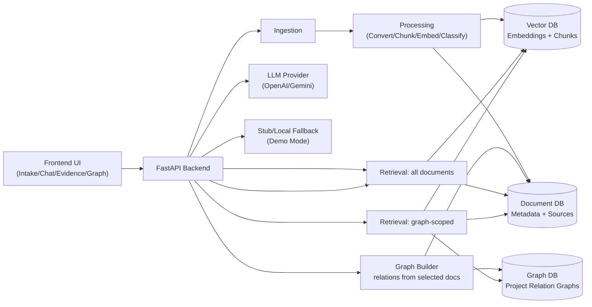

# Multimodal Context Graph RAG

Ein portfolio-tauglicher Demo-Stack für **multimodale Ingestion**, **RAG-Suche** und **Graph-basierte Kontextmodellierung** – inklusive UI, API und nachvollziehbarer Evidence-Ausgabe.

> Status: Demo/Prototype. Funktioniert ohne echte API-Keys im **Demo Mode**.

## Features

- Datei- und E-Mail-Ingestion (inkl. Attachment-Flow)
- Dokumentkonvertierung (TXT nativ, optionale Docling-Pipeline)
- Chunking + Embedding + Retrieval
- Evidence-basierte Antworten mit Quellenhinweisen
- Dokument-/Graph-Views für Kontextbeziehungen
- Optionaler LLM-Provider (OpenAI/Gemini) mit lokalem Fallback
- Privacy-by-default Logging (keine Rohinhalte in Standard-Logs)

## Architektur (Kurzüberblick)



Detailliertes Diagramm: [`docs/architecture.md`](docs/architecture.md)

Zusätzlich enthält die Architektur-Doku jetzt ein eigenes Mermaid-Diagramm für **projektbezogene Relationsgraphen** und **Scope Retrieval im Chat** (Graph-Auswahl → Dokument-Subset → semantische Suche mit besser erkennbaren Verknüpfungen).

Retrieval ist explizit in zwei Modi modelliert: **global über alle Dokumente** oder **optional graph-scoped über einen individuellen Relationsgraphen**.

## Projektstruktur

- `frontend/` – statische Web-Oberfläche
- `backend/` – FastAPI-Endpunkte, Ingestion, RAG, Provider-Integration
- `api/` + `rag-core/` – TypeScript-Module für RAG-Teilflüsse und Supabase-bezogene Logik
- `db/` – SQL-Schema, RLS, Indexe
- `docs/` – Security-/Data-Notes, Architektur, ADRs
- `tests/` + `backend/tests/` – TS- und Python-Tests

## Schnellstart (Demo Mode)

### Voraussetzungen

- Docker + Docker Compose

### Starten

```bash
docker compose up --build
```

Services:
- Frontend: http://localhost:3000
- Backend: http://localhost:8000
- Mailpit: http://localhost:8025

### Stoppen

```bash
docker compose down
```

## Konfiguration

Verwende `.env.example` als Vorlage:

```bash
cp .env.example .env
```

Ohne gesetzte `OPENAI_API_KEY`/`GEMINI_API_KEY` läuft das Projekt im lokalen Demo-Fallback (kein harter API-Key-Zwang).

## Datenschutz- und Security-Prinzipien

- Keine produktiven Secrets im Repository
- Keine absichtlichen PII-Beispieldaten
- Reduzierte Logging-Tiefe für sensible Inhalte
- Siehe auch: [`SECURITY.md`](SECURITY.md)

## Limitations

- Kein Production-Hardening (Auth, RBAC, Observability) out of the box
- Multimodale Konvertierung via Docling ist optional und ressourcenabhängig
- Modellqualität hängt bei aktivem Provider von externen APIs ab

## Demo Assets (synthetisch)

Synthetische Beispieldokumente ohne PII liegen unter `data/sample_documents/`.

## Roadmap

- [ ] Optimizing OCR
- [ ] Optimizing 3D Viewer
- [ ] Optimizing dynamic Search Engine for tabular data
- [ ] Provide Sample Data


## Screenshots

- docs/screenshots/01_ingestion.png
- docs/screenshots/02_chat.png
- docs/screenshots/03_evidence_viewer.png
- docs/screenshots/04_graph_builder.png
- docs/screenshots/05_settings.png

## Weitere Dokumentation

- [`docs/architecture.md`](docs/architecture.md)
- [`docs/guides/demo-mode.md`](docs/guides/demo-mode.md)
- [`docs/guides/development.md`](docs/guides/development.md)
- [`docs/adr/0001-demo-mode-and-provider-fallback.md`](docs/adr/0001-demo-mode-and-provider-fallback.md)
- [`docs/decisions/vector-db-decision.md`](docs/decisions/vector-db-decision.md)
- [`docs/specs/product-spec.md`](docs/specs/product-spec.md)
