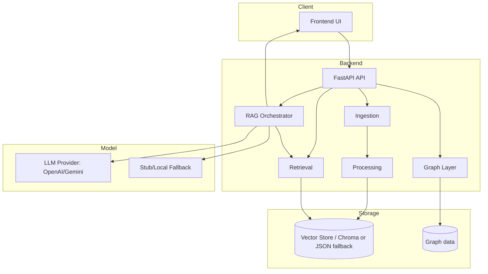
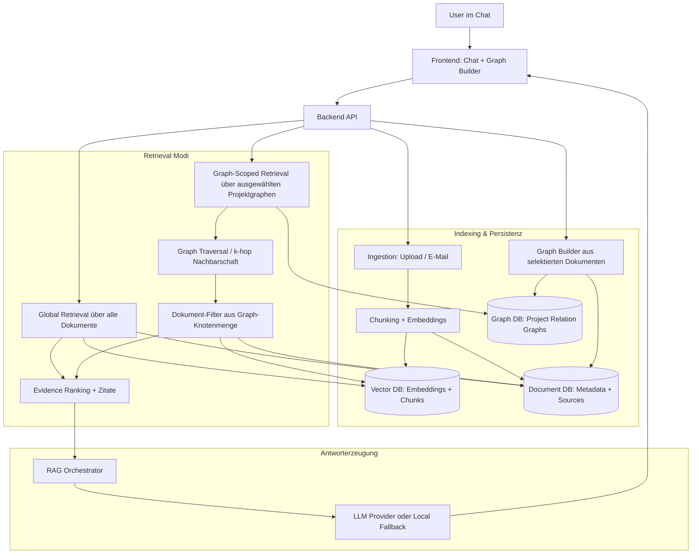

# Architecture

## Components and interfaces

- **Frontend UI** (`frontend/`): Intake, Chat, Evidence Viewer, Graph interactions.
- **API Layer** (`backend/app.py`): REST endpoints for ingestion, query, classification, graph workflows.
- **Ingestion Layer** (`backend/ingestion.py`): upload handling, email composition/inbox ingestion, format parsing.
- **Processing Layer** (`backend/chunking.py`, `backend/docling_integration.py`, `backend/classification.py`): conversion, chunking, embeddings, optional classification.
- **Retrieval Layer** (`backend/vector_store.py`, `backend/chroma_store.py`): vector search with storage fallback path.
- **Graph Layer** (`backend/graph_store.py`): document relation graph and versions.
- **LLM Layer** (`backend/llm_provider.py`, `backend/rag.py`): external providers (OpenAI/Gemini) plus local fallback in demo mode.

## Data flow

1. **Ingestion**: user uploads files or composes emails in UI.
2. **Processing**: backend validates input, optionally converts document formats, chunks text, computes embeddings, stores metadata.
3. **Indexing**: embeddings + chunk metadata are persisted for retrieval; graph relations can be added.
4. **Query**: query endpoint embeds query, searches store, assembles evidence context.
5. **Answer**: backend uses provider response when available/valid, otherwise local extractive fallback.
6. **UI rendering**: answer + evidence + warnings are shown in chat/evidence views.

## Mermaid diagram

## Mermaid diagram: Project Relation Graph + Scoped Retrieval

